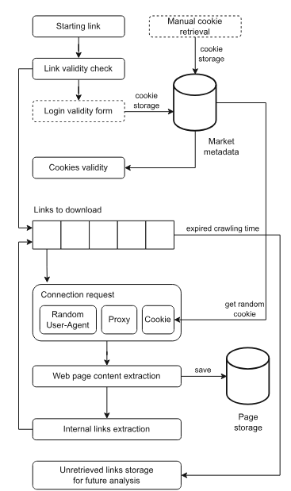

# CRATOR

[Read the paper here](https://arxiv.org/html/2405.06356v1#S3.F1). CRATOR is a dark web crawler. The original project has very little documentation besides the paper. In my opinion, it is worse than ACHE, but it has some viable use cases.

## Features

- Containerized
- Designed specifically for Tor
- Cookies
- Login form completion
- Captcha detection
- IP rotation
- User Agent rotation
- URL validity checking

## Installation

```bash
git clone https://github.com/DylanM5/Crator-Docker.git
cd Crator-Docker
```

## Usage

```bash
docker compose build
docker compose up -d
docker compose down
docker compose logs -f
```

## Project Structure



```text
Crator/
├── Dockerfile
├── docker-compose.yml
├── requirements.txt
├── resources/
│   ├── config.yml          # Crawler configuration (max links, depth, wait time)
│   ├── seeds.yml           # List of seeds to crawl
├── data-crator/            # Mounted volume for crawled data output
└── python/
  ├── crator.py             # Entry point: parses args, starts crawler
  ├── crawler.py            # Orchestrates crawling
  ├── downloader.py         # Threaded downloader: queues URLs for async fetching
  ├── handler.py            # TorHandler (proxy setup), CookieHandler
  ├── saver.py              # FileSaver: saves HTML pages to disk
  ├── monitor.py            # CrawlerMonitor: tracks crawling stats (nodes, edges)
  ├── detector.py           # Captcha / redirect detection logic
  └── utils/
    ├── config.py           # Configuration class: loads config.yml settings
    └── seeds.py            # Seed URL utilities
```


## Configuration

You can change the crawler behavior by editing `resources/crator.yml`.

| Parameter | Description |
|-----------|-------------|
| `crawler.depth` | Maximum crawl depth from seed |
| `crawler.max_links` | Maximum number of links to crawl |
| `crawler.max_time` | Maximum runtime in seconds |
| `crawler.wait_request` | Delay between requests in milliseconds |
| `project_name` | Name prefix for the output folder |


## Cookies

Some websites require authentication to access content. CRATOR supports cookie based authentication by adding cookies to `resources/crator.yml`.

### Getting Cookies

To obtain valid cookies for a site:

1. Open the Tor Browser and navigate to the target site
2. Log in manually
3. Open Developer Tools (F12), then the Network tab
4. Copy the `Cookie` header from a request

### Configuration Format

Add a `crawler.cookies` section to your `crator.yml`:

```yaml
crawler.cookies:
    seed: 
      "http://yourlink.onion/"
    cookies:
      "yourcookie (e.g. PHPSESSID=7jq1o9io5b63rsejq9nrvgqpk1)"
```

## IP Rotation

CRATOR includes IP rotation to avoid detection.

- Connects to the Tor Control Port (9051) to request a new circuit (`NEWNYM` signal)
- Automatically triggers when captchas or blocks are detected

## User Agent Rotation

CRATOR rotates User Agents for every request to simulate different browsers and operating systems.

- Uses [`fake-useragent`](https://pypi.org/project/fake-useragent/)
- A new User Agent string (e.g. Chrome on Windows, Firefox on Linux) is generated for every HTTP request
- Helps avoid fingerprinting and bot detection

## Data

Crawled data is stored in the `data-crator/` directory, organized by date and seed domain hash:

- `pages/`: Saved HTML content (`0.html`, `1.html`...)
- `graph/`: Network structure (`nodes.csv`, `edges.csv`)
- `monitor/`: Crawl statistics (`crawledpages.csv`, `scheduled.csv`)
